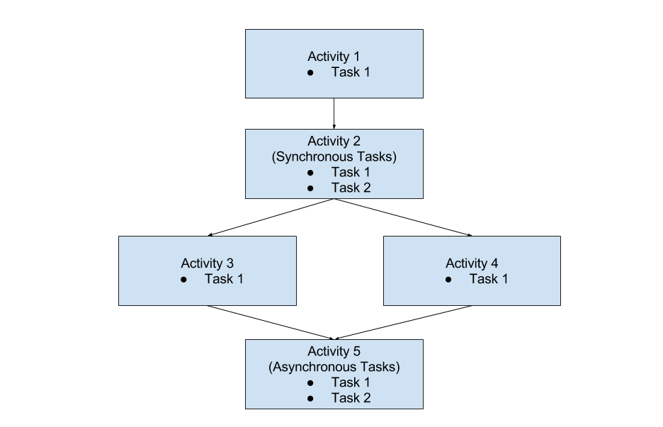

# Hello Garcon

A simple intro Garcon workflow.



### Installation

#### Dependencies
- python 3.4

#### Set up a virtual Python environment
```sh
$ pipenv install
```
#### Set up environment variables
.env.shadow is a template environment variable script that exports keys and values necessary for the app.  You will need to copy this file to `.env` and populate the necessary keys.
```sh
$ cp .env.shadow .env
$ vim .env
$ source .env
```

### Running a Garcon Workflow

In separate terminals run a Decider & a Worker

(don't forget to activate the virtualenv and set the required .env variables first in each terminal)

#### Garcon Worker
```sh
$ pipenv run python ./run_worker.py 
```

#### Garcon Decider
```sh
$ pipenv run python ./run_decider.py 
```
#### Garcon Visualiser
```sh
$ pipenv run python -m garcon.visualiser flow.py summary dev 1.0
```

Once a Decider & Worker are running, open another terminal & execute a workflow.

#### Execute SWF flow
```sh
$ source env/bin/activate
$ source .env
$ python ./execute_workflow.py 
```

After executing `python ./execute_workflow.py`, a SWF flow will be visible in the AWS console. Once the Decider & Worker pick up the workflow request from AWS, they will begin printing to standard output in their terminals.

#### Troubleshooting

* When a Decider / Worker is killed and restarted in the middle of the polling AWS, there is a risk for the next 70 seconds that AWS will mistakenly send a Decider/Worker action to the old, dead daemon [see here](https://github.com/aws/aws-flow-ruby/issues/31#issuecomment-37559273). If it takes longer than a minute for a workflow to begin executing, kill the work flow via the AWS console.
